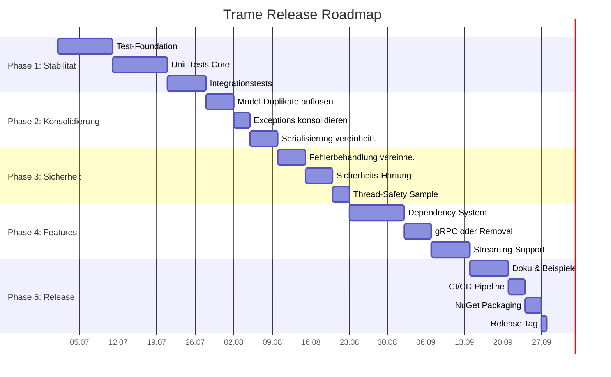
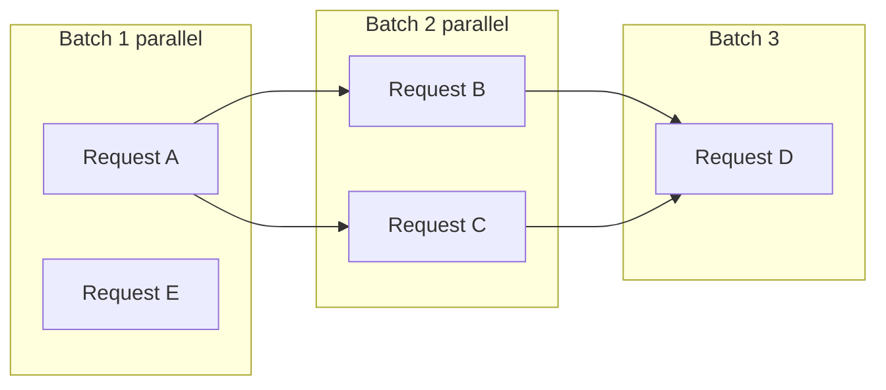

# Trame Release-Readiness-Plan

> Ziel: Trame von Prototyp-Stadium zu einem produktionstauglichen, release-fähigen RPC-Framework führen.
>
> Erstellt: 2026-07-01 · Basierend auf der technischen Bewertung

---

## Übersicht: Phasen & Meilensteine



| Phase | Fokus | Dauer (geschätzt) | Priorität |
|-------|-------|-------------------|-----------|
| **1** | Stabilität & Tests | ~4 Wochen | P0 – Kritisch |
| **2** | Konsolidierung & Cleanup | ~2 Wochen | P0 – Kritisch |
| **3** | Sicherheit & Produktion | ~2 Wochen | P1 – Hoch |
| **4** | Features vervollständigen | ~4 Wochen | P1 – Hoch |
| **5** | Dokumentation & Release | ~2 Wochen | P2 – Mittel |

---

## Phase 1: Stabilität & Tests (P0)

### 1.1 Test-Foundation aufbauen

- [ ] `TrameTests`-Projekt strukturieren:
  ```
  TrameTests/
  ├── Unit/
  │   ├── Core/
  │   │   ├── TrameInvokerTests.cs
  │   │   ├── TrameDiscoveryServiceTests.cs
  │   │   ├── DependencyResolverTests.cs
  │   │   └── JsonDependencyReplacerTests.cs
  │   ├── Client/
  │   │   ├── TrameCallTests.cs
  │   │   ├── TrameRestJsonClientTests.cs
  │   │   ├── TrameSignalrClientTests.cs
  │   │   └── TrameWebSocketClientTests.cs
  │   └── Common/
  │       └── AttributeTests.cs
  ├── Integration/
  │   ├── RestTransportTests.cs
  │   ├── SignalRTransportTests.cs
  │   ├── WebSocketTransportTests.cs
  │   └── MultiRequestBatchTests.cs
  └── Fixtures/
      ├── TestControllers.cs
      └── WebAppFactory.cs
  ```
- [ ] Test-Dependencies hinzufügen: `xunit`, `Moq`, `FluentAssertions`, `Microsoft.AspNetCore.Mvc.Testing`
- [ ] `WebApplicationFactory<Program>`-Fixture für Integrationstests

### 1.2 Unit-Tests für TrameCore

| Komponente | Test-Cases | Beschreibung |
|-----------|------------|-------------|
| `TrameInvoker` | 12+ | Controller-Registrierung, Methoden-Lookup, Parameter-Auflösung, Async/Sync, CancellationToken-Injection, Expression-Tree-Kompilierung, Autorisierungs-Check |
| `TrameDiscoveryService` | 8+ | Cache-Verhalten, Type-Registrierung, Nested Types, Generic Types, Beispiel-Generierung, Invalidate |
| `DependencyResolver` | 6+ | JsonPath-Extraktion, fehlende Pfade, komplexe JSON, Arrays |
| `JsonDependencyReplacer` | 8+ | Alias-Ersetzung, rekursive Traversierung, Parent-Update, fehlende Aliase |
| `InvokeInfo` | 4+ | IsAsync, HasResult, CompiledInvocation |

### 1.3 Integrationstests pro Transport

- [ ] **REST**: Single-Call, Multi-Call, Discovery-Endpoint, Error-Responses, CamelCase-Filter
- [ ] **SignalR**: Single `DoWork`, Batch `DoWorkMany`, Reconnect-Verhalten, Auth-Token
- [ ] **WebSocket**: Single/Multi-Erkennung, Multi-Frame-Nachrichten, Close-Handling
- [ ] **Cross-Transport**: Gleiches `TrameRequest` über alle 3 Transporte → gleiche Response
- [ ] **Batch**: Parallel vs. Serial, Dependency-Chaining im Serial-Mode

### 1.4 Akzeptanzkriterien Phase 1
- [ ] Mindestens **80% Code-Abdeckung** für `TrameCore`
- [ ] Mindestens **70% Code-Abdeckung** für `TrameClient`
- [ ] Alle Integrationstests für 3 Transporte grün
- [ ] CI-Pipeline (GitHub Actions) mit Test-Run bei jedem Push

---

## Phase 2: Konsolidierung & Cleanup (P0)

### 2.1 Model-Duplikate auflösen

**Problem**: `TrameRequest`, `TrameResponse`, `TrameMultiRequest`, `TrameParameter`, `ExecutionMode` existieren dupliziert in `TrameCore` und `TrameClient`.

- [ ] Alle Shared-Models nach `TrameCommon` verschieben
- [ ] `TrameCommon` von `netstandard2.1` → `net8.0` ändern (Konsistenz)
- [ ] MessagePack-Attribute in `TrameCommon` (benötigt `MessagePack.Annotations`-Dependency)
- [ ] `TrameCore` und `TrameClient` referenzieren `TrameCommon` statt eigener Kopien
- [ ] Duplikate in `TrameCore` und `TrameClient` löschen
- [ ] Namespaces vereinheitlichen: `Trame.Common.Models`

**Zielstruktur**:
```
TrameCommon/
├── Models/
│   ├── TrameRequest.cs
│   ├── TrameResponse.cs
│   ├── TrameMultiRequest.cs
│   ├── TrameParameter.cs
│   └── ExecutionMode.cs
├── Attributes/
│   └── (bestehende)
└── Exceptions/
    └── TrameException.cs
```

### 2.2 Exceptions konsolidieren

**Problem**: `TrameException` ist in `TrameCommon/Exceptions/` und `TrameClient/Exceptions/` dupliziert.

- [ ] `TrameClient/Exceptions/TrameException.cs` löschen
- [ ] `TrameClient` referenziert `TrameCommon.TrameException`
- [ ] Falls Client-spezifische Exceptions nötig: `TrameTransportException`, `TrameConnectionException` als Subklassen

### 2.3 Serialisierungsstrategie vereinheitlichen

**Problem**: Gleichzeitige Nutzung von `System.Text.Json`, `Newtonsoft.Json` und `MessagePack` mit geschichteter Serialisierung (MessagePack außen, JSON innen).

- [ ] Entscheidung treffen:
  - **Option A** (empfohlen): `System.Text.Json` als primäres JSON-Framework in allen Projekten. `Newtonsoft.Json` aus `TrameRest` entfernen.
  - **Option B**: MessagePack als alleiniges Wire-Format, JSON nur für Discovery/UI.
- [ ] `CamelCaseJsonFilterAttribute` auf `System.Text.Json` umstellen (falls Option A)
- [ ] Einheitliche `JsonSerializerOptions` in `TrameCommon` zentral definieren
- [ ] `TrameClientBase` nutzt bereits `System.Text.Json` – als Standard etablieren

### 2.4 Aufräumarbeiten

- [ ] `TrameCore.csproj.bak` und `TrameHub.csproj.bak` löschen
- [ ] `TrameRest.csproj.user`, `Trame.csproj.user`, `Trame.sln.DotSettings.user` → `.gitignore`
- [ ] Auskommentierten Code in `Program.cs` entfernen (statische Dateien, `MapGrpcService`)
- [ ] `Trame.http` mit relevanten Trame-Beispiel-Requests füllen
- [ ] `bin/` und `obj/` Verzeichnisse → `.gitignore` (falls noch nicht geschehen)

### 2.5 Akzeptanzkriterien Phase 2
- [ ] Keine Model-Duplikate mehr zwischen Projekten
- [ ] Nur eine `TrameException`-Klasse
- [ ] Nur ein JSON-Framework (`System.Text.Json`)
- [ ] Keine `.bak`-Dateien oder auskommentierter Tot-Code

---

## Phase 3: Sicherheit & Produktion (P1)

### 3.1 Fehlerbehandlung vereinheitlichen

**Problem**: Jeder Transport behandelt Fehler unterschiedlich.

- [x] Einheitliches Fehlermodell definieren:
  ```csharp
  public class TrameError
  {
      public int Code { get; set; }           // HTTP-ähnlicher Statuscode
      public string Message { get; set; }     // Fehlermeldung
      public string? Details { get; set; }    // Stacktrace (nur in Development)
      public string? RequestId { get; set; }  // Korrelations-ID
  }
  ```
- [x] Alle Transporte mappen Server-Fehler → `TrameResponse.Code != 200` + `TrameError`
- [x] Alle Clients werfen `TrameException` mit `TrameError` als Payload
- [x] `OperationCanceledException` → Code 499 (Client Closed Request) – jetzt auf beiden REST-Endpunkten (Minimal-API + MVC-Controller)
- [x] `[TrameAuthorise]`-Fehler → Code 401 (vorher fälschlich 405). `RequestId` wird auf allen Fehler-Pfaden gesetzt. `Details` nur bei `EnableDetailedErrors`/Development. *(Offen: 403 für "authentifiziert, aber nicht erlaubt" — benötigt Rollen-Unterscheidung im Attribut; Roadmap.)*

### 3.2 Sicherheits-Härtung

- [x] `EnableDetailedErrors` an `IHostEnvironment.IsDevelopment()` binden:
  ```csharp
  EnableDetailedErrors = builder.Environment.IsDevelopment()
  ```
  *(Verdrahtet in `AddTrame`: `TrameOptions.EnableDetailedErrors || env.IsDevelopment()`.)*
- [ ] CORS-Default-Policy restriktiver konfigurieren (kein `AllowAnyOrigin` als Fallback)
- [ ] Rate-Limiting: `Microsoft.AspNetCore.RateLimiting` integrieren (z.B. Token Bucket pro Connection)
- [ ] Request-Size-Limit konfigurierbar machen und validieren
- [ ] `[TrameAuthorise]` um Policy-basierte Autorisierung erweitern (`IAuthorizationHandler`)
- [ ] JWT-Bearer-Auth-Middleware als optionales Trame-Feature anbieten
- [ ] Input-Validation: Parameter-Validierung mit `DataAnnotations` oder FluentValidation

### 3.3 Thread-Safety in Sample-App

- [ ] `CustomerService`: `List<Customer>` → `ConcurrentDictionary<int, Customer>`
- [ ] ID-Generatoren mit `Interlocked.Increment` absichern
- [ ] Oder: `lock`-basierten Schutz für verbundene Operationen (Add + Address)

### 3.4 Akzeptanzkriterien Phase 3
- [x] Einheitliches Fehlermodell über alle Transporte
- [x] `EnableDetailedErrors` ist Development-only
- [ ] Rate-Limiting aktiv
- [ ] Sample-App thread-safe bei parallelen Batch-Calls

---

## Phase 4: Features vervollständigen (P1)

### 4.1 Dependency-System vervollständigen

**Aktueller Status**: Parallel-Mode ignoriert Dependencies. Keine Zykluserkennung. Keine topologische Sortierung.

- [ ] **Dependency-Deklaration**:
  - `[TrameMethod]` um `Inputs` und `Outputs` erweitern (deklarative Dependencies)
  - Beispiel: `[TrameMethod("CreateOrder", Outputs = ["orderId"], Inputs = ["customerId"])]`
- [ ] **Topologische Sortierung**:
  - `DependencyGraphBuilder` implementieren
  - Anfragen nach Abhängigkeiten sortieren
  - Unabhängige Anfragen in parallele Batches gruppieren
- [ ] **Zykluserkennung**:
  - Zyklus-Erkennung im Graph → Fehler werfen, nicht endlos schleifen
  - Klare Fehlermeldung mit beteiligten Aliassen
- [ ] **Parallel-Batches**:
  - Batch 1: Alle Requests ohne Dependencies → parallel
  - Batch 2: Alle Requests, die nur Batch-1-Dependencies haben → parallel
  - Usw. (Level-basierte Ausführung)
- [ ] Tests: Zyklus, Diamant-Dependency, Lineare Kette, unabhängige Parallels



### 4.2 gRPC-Transport: Implementieren oder Entfernen

**Entscheidung erforderlich**:

- **Option A – Implementieren**:
  - `.proto`-Definition für `TrameService` erstellen
  - `TrameGrpcService : TrameService.TrameServiceBase` implementieren
  - Delegation an `ITrameCore.InvokeDi()`
  - `MapGrpcService<TrameGrpcService>()` in `Program.cs` aktivieren
  - Client: `TrameGrpcClient : ITrameClient` in `TrameClient` hinzufügen
  - Vorteil: Binary-Protokoll, HTTP/2-Multiplexing, offizieller Standard

- **Option B – Entfernen** (empfohlen wenn gRPC nicht auf Roadmap):
  - `TrameGrpc`-Projekt aus Solution entfernen
  - `Grpc.AspNetCore`-Dependency aus `Trame.csproj` entfernen
  - Auskommentierte `MapGrpcService`-Zeile löschen
  - README um gRPC-Referenz bereinigen

### 4.3 Streaming-Support

- [ ] `IAsyncEnumerable<T>` als Rückgabetyp unterstützen
- [ ] Server-Streaming über SignalR (`IAsyncEnumerable` → Client-Stream)
- [ ] Server-Streaming über WebSocket (Text-Frame pro Element)
- [ ] Client-Streaming (Client → Server `IAsyncEnumerable`)
- [ ] Bidirektionales Streaming (nur gRPC/SignalR)
- [ ] `StreamBufferCapacity` und `MaximumReceiveMessageSize` korrekt anwenden

### 4.4 Interceptors / Middleware-Pipeline

- [ ] `ITrameInterceptor`-Interface definieren:
  ```csharp
  public interface ITrameInterceptor
  {
      Task<TrameResponse?> InvokeAsync(
          TrameRequest request,
          TrameInvocationDelegate next,
          CancellationToken ct);
  }
  ```
- [ ] Vor/nach Methodenaufruf: Logging, Tracing, Caching, Validation, Metrics
- [ ] Registrierung via DI: `builder.Services.AddTrameInterceptor<LoggingInterceptor>()`
- [x] OpenTelemetry-Kompatibilität (Tracing-Spans pro RPC-Call)

### 4.5 Akzeptanzkriterien Phase 4
- [ ] Dependency-System unterstützt parallele Batches mit topologischer Sortierung
- [ ] Zykluserkennung wirft klare Fehler
- [ ] gRPC-Entscheidung umgesetzt (implementiert oder entfernt)
- [ ] Streaming für SignalR und WebSocket funktioniert
- [ ] Interceptor-Pipeline funktionsfähig

---

## Phase 5: Dokumentation & Release (P2)

### 5.1 Dokumentation

- [ ] **README.md** überarbeiten:
  - Architektur-Überblick mit Diagramm
  - Getting-Started (Server-Setup + Client-Aufruf)
  - Transport-Vergleich (REST vs. SignalR vs. WebSocket)
  - Feature-Liste
- [ ] **ARCHITECTURE.md** erstellen:
  - Solution-Struktur
  - Request/Response-Flow
  - Dependency-Alias-System
  - Discovery/MEX
  - Extension-Punkte
- [ ] **API-Reference** (automatisch generiert):
  - `docfx` oder `Sandcastle` Konfiguration
  - XML-Dokumentationskommentare in allen öffentlichen APIs
- [ ] **Beispiele**:
  - `samples/`-Verzeichnis mit:
    - `QuickStart/` – Minimal-Beispiel
    - `BatchRequests/` – Multi-Call mit Dependencies
    - `Streaming/` – IAsyncEnumerable
    - `CustomTransport/` – Eigenen Transport implementieren
    - `Authorization/` – JWT + Rollen
- [ ] **Migration-Guide** falls Breaking Changes
- [ ] `Trame.http` mit vollständigen Beispiel-Requests:
  - Single-Call, Multi-Call, Discovery

### 5.2 CI/CD Pipeline

- [ ] `.github/workflows/build.yml`:
  ```yaml
  jobs:
    build:
      - dotnet restore
      - dotnet build --configuration Release
      - dotnet test --collect:"XPlat Code Coverage"
      - codecov upload
    lint:
      - dotnet format --verify-no-changes
    security:
      - dotnet list package --vulnerable
  ```
- [ ] Branch-Protection: PRs erfordern grüne Build + Tests
- [ ] SonarQube-Integration (optional)

### 5.3 NuGet-Paketierung

- [ ] Versioning-Strategie festlegen: SemVer 2.0
- [ ] NuGet-Metadaten in `.csproj`-Dateien:
  ```xml
  <PackageId>Trame.Core</PackageId>
  <Version>1.0.0</Version>
  <Authors>...</Authors>
  <Description>...</Description>
  <PackageReadmeFile>README.md</PackageReadmeFile>
  <PackageIcon>icon.png</PackageIcon>
  <License>LICENSE</License>
  ```
- [ ] Pakete definieren:
  - `Trame.Common` – Attribute, Exceptions, Models
  - `Trame.Core` – Invoker, Discovery
  - `Trame.Hub` – SignalR-Transport
  - `Trame.Rest` – REST-Transport
  - `Trame.WebSocket` – WebSocket-Transport
  - `Trame.Client` – Client-Bibliothek
  - `Trame.DeveloperUi` – Developer-UI
  - `Trame.Server` – Meta-Paket (referenziert alle Transporte + DevUI)
  - `Trame.Telemetry` – Optionaler OpenTelemetry-SDK-Bootstrap (abonniert den `Trame`-ActivitySource, OTLP/Console-Exporter + AspNetCore/HttpClient-Instrumentierung)
- [ ] `dotnet pack` in CI-Pipeline
- [ ] NuGet-Source-Set (öffentliche Registry oder Private Feed)
- [ ] Symbol-Packages (`snupkg`) für Debugging

### 5.4 Release-Checklist

- [ ] Alle Tests grün (Unit + Integration)
- [ ] Keine bekannten Security-Issues (`dotnet list package --vulnerable`)
- [ ] `dotnet format` – keine Format-Verletzungen
- [ ] README, ARCHITECTURE, API-Reference vollständig
- [ ] Beispiele lauffähig und getestet
- [ ] NuGet-Pakete lokal testbar (`dotnet pack` + lokaler Feed)
- [ ] CHANGELOG.md gepflegt
- [ ] Git-Tag `v1.0.0` gesetzt
- [ ] GitHub-Release mit Release-Notes

### 5.5 Akzeptanzkriterien Phase 5
- [ ] Vollständige Dokumentation (README + Architecture + Beispiele)
- [ ] CI/CD-Pipeline grün bei Release-Commit
- [ ] NuGet-Pakete veröffentlicht und konsumierbar
- [ ] Git-Tag `v1.0.0`

---

## Zusammenfassung: Checkliste je Priorität

### P0 – Muss vor Release erledigt sein
- [ ] Test-Foundation mit ≥80% Core-Abdeckung
- [ ] Model- und Exception-Duplikate aufgelöst
- [ ] Serialisierungsstrategie vereinheitlicht
- [ ] Einheitliches Fehlermodell
- [ ] Tot-Code und `.bak`-Dateien entfernt

### P1 – Sollte vor Release erledigt sein
- [ ] Sicherheits-Härtung (DetailedErrors, CORS, Rate-Limiting)
- [ ] Thread-Safety in Sample-App
- [ ] Dependency-System mit topologischer Sortierung
- [ ] gRPC-Entscheidung umgesetzt
- [ ] Streaming-Support
- [ ] Interceptor-Pipeline

### P2 – Nice-to-have für v1.0
- [ ] Vollständige Dokumentation & Beispiele
- [ ] CI/CD-Pipeline
- [ ] NuGet-Pakete
- [ ] Release-Tag

---

## Risiken & Mitigation

| Risiko | Wahrscheinlichkeit | Impact | Mitigation |
|--------|-------------------|--------|------------|
| Breaking Changes bei Model-Konsolidierung | Hoch | Mittel | Migration-Guide schreiben, SemVer-Major-Bump |
| gRPC-Implementierung verzögert Release | Mittel | Niedrig | gRPC als Post-1.0-Feature deklarieren |
| Performance-Regression durch vereinheitlichte Serialisierung | Niedrig | Hoch | Benchmark-DotNet vor/nach Migration |
| Dependency-Graph-Algorithmus zu komplex | Mittel | Mittel | Level-basierte Sortierung statt voller TopoSort |
| Developer-UI inkonsistent mit API-Änderungen | Mittel | Niedrig | UI-Tests in Integrationstests aufnehmen |