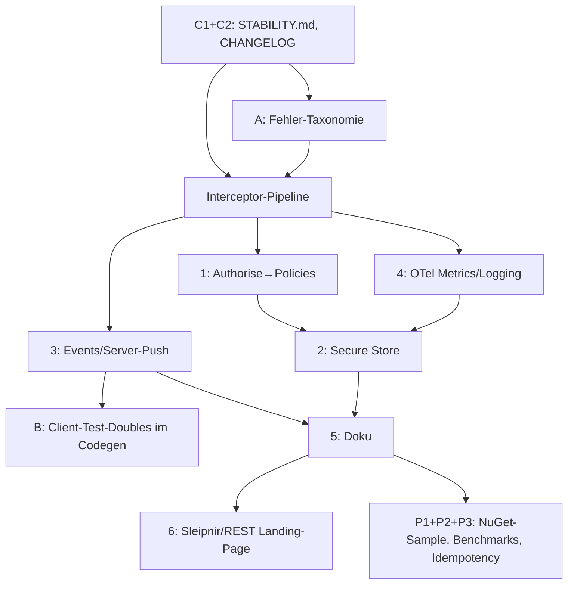

# Sleipnir Roadmap

> Post-v1, forward-looking. This file lists features that deliberately did *not* make the first
> public release — either because they would touch the v1 contract, or because they are optional
> and must not change the code-first default model. As of: 2026-08-07.
>
> **Shipped with v1:** an isomorphic JS/TypeScript client (REST + WebSocket) at
> [`clients/ts/`](clients/ts/) (`npm i sleipnir-client`). SignalR for JS/TS and
> discovery → typed client codegen remain open (see "Later").
>
> **In progress — client stub generators:** typed client stubs (TS/JS/C#/Python) generated from
> runtime discovery, plus the v1.1 source-generator endgame. Tracked in
> [`CLIENT_GENERATION.md`](CLIENT_GENERATION.md) (Increment 1: TS + JS + `sleipnir-gen` CLI).
>
> **New — Benutzbarkeit-Roadmap (v1.1 → v1.2):** the section below structures the next increments
> around *making Sleipnir productively usable*, not adding depth. Sleipnir's technical depth is already
> in place; the gating items for adoption are stability promises, coherent architecture seams,
> real-time coherence, and adoption-positioning. See
> [Benutzbarkeit-Roadmap](#benutzbarkeit-roadmap--sleipnir-produktiv-benutzbar-machen).

---

## Motivation: what batching + dependency resolution deliver in practice

Sleipnir's core promise is not "a pretty client API" but **eliminating N+1 and roundtrip cost without
the server building special-purpose methods.** An observed example from a real application:

> A page that originally needed **over 5 seconds** to load dropped to **around 100 ms** with
> targeted Sleipnir batching — **with no server-side change**, i.e. no extra method built just for
> this one case. The customer list, prefetching the first two, and the order lines of the first
> customer run in a single roundtrip, as parallel as the dependencies allow.

That is the potential the architecture carries: the client orchestrates, the server resolves and
parallelizes. The features documented below exist to make this model *safer* at scale — not to
replace it.

---

## Benutzbarkeit-Roadmap — Sleipnir produktiv benutzbar machen

> Sleipnir's technical depth is in place (multi-transport, codegen, drift-check, security posture,
> DevUI, dependency chaining). What gates adoption is **not** the next feature — it is
> **stability promises, coherent architecture seams, real-time coherence, and adoption
> positioning.** This section structures the next increments around those. Detail sections for the
> individual features (v1.1 Versioning, Binary, Later) remain below as reference; this is the
> phase plan that orders them.

### Leitgedanke

Sleipnir ist nicht zu wenig feature-reich, sondern *zu wenig benutzbar*. Was zwischen heute und
"produktiv adoptiert" steht, ist Adoptions-Reibung und Produktionsreife-Garantien — nicht Tiefe.
Die Roadmap ordnet danach: erst das Fundament, das jeder weitere Schritt braucht; dann die
Architektur-Seams, die spätere Refactors vermeiden; dann Features; dann Doku/Polish, die die
Adoption öffnen.

### Phasen-Übersicht

| Phase | Fokus | Items | Warum jetzt |
|---|---|---|---|
| **0 — Fundament** | Stabilitätsversprechen | C1 `STABILITY.md`, C2 `CHANGELOG.md` + SemVer | asymmetrisch billig, öffnet Produktion-Adoption; vor jedem Feature, das stabile Oberflächen definiert |
| **1 — Architektur-Fundament** | Ein Seam für Auth + OTel + Fehler | 1 Authorise→Policies, 4 OTel Metrics/Logging, A Fehler-Taxonomie | drei Speziallocken heute → eine Interceptor-Pipeline; einzeln erweitern heißt drei Refactors |
| **2 — Produktionsreife** | Persistenz | 2 North-Bound Secure Store | setzt Phase 1 voraus (auth-gated Store); vor Phase 3, um Store-Wechsel nicht mit Events-Lifecycle zu kollidieren |
| **3 — Echtzeit-Kohärenz** | Push + Testbarkeit | 3 Events/Server-Push, B Client-Test-Doubles | Events brauchen Codegen-Erweiterung → B dort billig; nachträglich teuer |
| **4 — Doku & Adoption-Polish** | Adoption öffnen | 5 Doku, 6 Sleipnir/REST-Positionierung, P1 NuGet-first-Sample, P2 Public Benchmarks, P3 Idempotency-Guidance | Doku nach Features (sonst lügt sie APIs herbei); Polish setzt stabile Story voraus |

### Kritische Pfade & Koppelungen

**Drei harte Koppelungen, nicht auflösbar:**

- **1 + 4 + A = ein Durchgang.** Auth, OTel und Fehler-Klassifizierung sind heute drei
  Speziallocken im Invoker (`CheckAuthorisation`, Tracing-Hooks, Error-Factory). Eine
  Interceptor-Pipeline ersetzt alle drei + zukünftige (Validation, Caching, Retry). Punkt 1, 4
  und A sind *ein* Architektur-Entscheid, nicht drei.
- **3 + B = ein Durchgang.** Events brauchen eine Codegen-Erweiterung (typisierte
  Subscribe-Oberfläche, `kind: "event"` in Discovery). Genau dann, wenn der Codegen ohnehin für
  Events erweitert wird, ist B (mockbare `ISleipnirClient`-Schnittstelle + In-Memory-Test-Transport)
  billig. Nachträglich teuer.
- **5 + 6 + Polish = nach Features.** Doku/Polish vor Features lügen APIs herbei.

### Phase 0 — Fundament (vor allem anderen)

| Item | Was | Erfolgskriterium |
|---|---|---|
| **C1** | `STABILITY.md` — Liste der garantiert-stabilen Oberfläche (`[SleipnirController]`, `[SleipnirMethod]`, `SleipnirCall`, `SleipnirOptions`, `SleipnirResponse`, Wire-Format, `discoveryVersion`) vs. experimentell (Codegen-Attribute, `Arg<T>`, Interceptors, Events). | Datei committed; jedes neue Feature deklariert darin stable/experimental. |
| **C2** | `CHANGELOG.md` + SemVer-Disziplin. | 1.0.0 rückwirkend changeloged; jedes Release hat Eintrag. |

**Warum zuerst:** Fehler-Taxonomie (A) und Interceptor-Pipeline (1+4) definieren *stabile*
Oberflächen — ohne Stabilitätsversprechen riskierst du, sie im nächsten Major zu brechen.
Außerdem signalisiert `STABILITY.md` dem Anwender "1.0.0 ist sicher für Produktion", was der
Nr.-1-Adoptions-Blocker ist. Klein, asymmetrisch hoher ROI. `CHANGELOG.md` existiert bereits und
ist fortzuführen.

### Phase 1 — Architektur-Fundament (gekoppelt, ein Durchgang)

| Item | Was | Verknüpfung |
|---|---|---|
| **1** | `[SleipnirAuthorise]` → Policies (`[SleipnirAuthorise(Policy=…)]` an ASP.NET Core `IAuthorizationHandler`), sodass `403` (authenticated-but-not-permitted) von `401` (not authenticated) unterscheidbar wird. | **Als Interceptor-Pipeline anlegen**, nicht als weitere Speziallogik im Invoker. `[SleipnirAuthorise]` wird zum default-Interceptor, `[SleipnirAnonymous]` zur Skip-Annotation. |
| **4** | OTel erweitern: Metrics (`sleipnir.call.duration`, `sleipnir.call.count`, `sleipnir.batch.fan_out`, `sleipnir.error.rate`) + Logging-Conventions (OTel-RPC-Semantic-Conventions), nicht nur Traces. | **Dieselbe Pipeline** — Tracing/Logging/Metrics sind Interceptors. Auth-Interceptor und OTel-Interceptor zusammen designen. |
| **A** | Fehler-Taxonomie: stabiler, transport-uniformer Katalog (InvalidArgument/NotFound/Unauthenticated/PermissionDenied/FailedPrecondition/Unavailable/ResourceExhausted). `SleipnirError.Code` + semantische Kategorie; generierte Clients werfen typisierte Exceptions. | **Vor der Pipeline festnageln** — Interceptors produzieren/klassifizieren Fehler. |

**Erfolgskriterium:** `RequireAuthentication` + Policy-basierte Auth via Pipeline; `sleipnir.*`-Metrics
in OTLP; ein `ERROR_CATALOG.md` mit den stabilen Codes; generierte Clients mit typisierten
Exceptions.

**Warum gekoppelt:** Auth, OTel und Fehler-Klassifizierung sind *drei Speziallocken*, die heute
im Invoker sitzen. Jede einzeln erweitern heißt drei Refactors. Eine Interceptor-Pipeline einmal
bauen heißt ein Seam für alle drei + zukünftige (Validation, Caching, Retry). Punkt 1, 4 und A
sind *ein* Architektur-Entscheid, nicht drei. Siehe auch *Later* unten (Policy-based
authorization, Input validation) — diese Punkte werden hier herein gehoben, nicht separat
verfolgt.

### Phase 2 — Produktionsreife

| Item | Was | Abhängigkeit |
|---|---|---|
| **2** | North-Bound Secure Store: Repository/DI-Muster, Persistenz (mind. eine dokumentierte Implementierung, z. B. EF/SQLite). `NotificationStore` → `INotificationRepository`. | Setzt Phase 1 voraus — Store-Zugriffe müssen auth-gated sein. |

**Erfolgskriterium:** Demo-Domain läuft gegen persistierten Store; Repository-Pattern in Doku als
empfohlene North-Bound-Struktur.

**Warum hier:** North-Bound braucht echte Persistenz. Aber *vor* Phase 1 wäre der Store nicht
auth-gated → unsicher. *Nach* Phase 3 (Events) würde der Store-Wechsel die
Events-Subscription-Lifecycle verkomplizieren. Phase 2 ist das natürliche Fenster.

### Phase 3 — Echtzeit-Kohärenz (gekoppelt)

| Item | Was | Verknüpfung |
|---|---|---|
| **3** | Events/Server-Push: `[SleipnirEvent]` + typisierte Subscribe-Oberfläche; Discovery-`kind: "event"`; Lifecycle (subscribe/unsubscribe, Reconnect-Resubscribe, gap-Semantik dokumentiert); WS/SignalR-only; Auth pro Subscription. | **Kompositionsregel festnageln:** Events *nicht chainbar* (wie Streams) — Compile-Fehler im Codegen, nicht Laufzeit-Überraschung. |
| **B** | Client-Test-Doubles: generierte Clients gegen mockbare `ISleipnirClient`-Schnittstelle + In-Memory-Test-Transport. | **Bei Events-Codegen-Erweiterung gleich designen** — Events brauchen Codegen-Erweiterung → dort mockbare Subscribe-Oberfläche mit designen. |

**Erfolgskriterium:** `client.chat.onMessageReceived(id).subscribe(…)` typisiert; Reconnect
re-subscribed automatisch; Auth an Subscribe-Zeit geprüft; generierter Client in Unit-Test ohne
Server mockbar; `kind: "event"` in Discovery.

**Warum gekoppelt:** Events brauchen eine Codegen-Erweiterung (typisierte Subscribe-Oberfläche).
Genau dann, wenn du Codegen ohnehin für Events erweiterst, ist B billig. Nachträglich teuer. B
ist kein separater Punkt, er gehört in 3's Codegen-Design.

### Phase 4 — Doku & Adoption-Polish

| Item | Was |
|---|---|
| **5** | Doku für Phase 1–3 anpassen: Interceptor-Pipeline, Policies, Fehler-Katalog, OTel-Metrics, Events-Lifecycle, Secure-Store-Pattern. |
| **6** | Sleipnir/REST Zusammenspiel auf Landing Page: "Sleipnir sits next to REST, shares the service layer" — die `BEST_PRACTICES.md` §4.6-Positionierung nach vorne. Explizit: "ASP.NET-Controller über dem Service ist ein erstklassiger Weg für Legacy/OpenAPI, kein Workaround." |
| **P1** | NuGet-first-Sample + Package-Matrix im README (Server/Client/Generator × NuGet/npm × Status). Quickstart ab `dotnet add package`. |
| **P2** | Public Benchmarks: `SleipnirBench`-Report veröffentlichen (Sleipnir-Batch vs. REST-Loop vs. gRPC). |
| **P3** | Idempotency/Retry-Guidance in Doku: welche Calls sind safe-to-retry; optionaler `Idempotency-Key` als Interceptor. |

**Erfolgskriterium:** Landing-Page-Positionierung trägt die "Sleipnir+REST"-Story; Quickstart ohne
Repo-Clone lauffähig; Benchmarks öffentlich; Retry-Regeln dokumentiert.

**Warum zuletzt:** Doku für Phase 1–3 braucht, dass sie fertig sind (sonst doku-st du unhaltbare
APIs). Polish-Items P1/P2/P3 sind Adoption-Öffner, aber sie *setzen* eine benutzbare stabile Story
voraus — vorher bewarben sie eine halbfertige Sache.

### Offene Design-Entscheidungen (pro Phase zu treffen)

| Phase | Entscheidung |
|---|---|
| 0 | Ist `discoveryVersion` ein SemVer-Feld oder additive-only-Counter? (Heute additive-only — bestätigen.) |
| 1 | Interceptor-Reihenfolge festlegen: Auth → Validation → Tracing → Method? (Auth *vor* allem anderen, inkl. OTel, sonst loggst du unautorisieren Traffic.) |
| 1 | Fehler-Taxonomie: eigene Codes oder an gRPC-Status-Codes lehnen? (gRPC-Anlehnung senkt polyglotte Adoption-Reibung.) |
| 3 | Events gap-Semantik: at-most-once-while-disconnected (v1) vs. `Last-Event-Id`-Resume (v1.x)? (**v1: at-most-once, dokumentiert. Resume als Phase R (experimental) geliefert** — opt-in `[SleipnirEvent(Resumable = true)]` + Client-Resume-Policy: at-least-once innerhalb des Replay-Fensters, Client dedup'd per `eventId`, Reconnect-Auth-Re-Check; genau-once + cross-process-durable bleiben future.) |
| 3 | Subscribe-Parameter (z. B. `chatId`) als First-Class in der Subscription-ID oder nachgelagertes Filter? (First-Class — dominiert in der Praxis.) |
| 4 | Positionierung: "Sleipnir + REST" als *erste* Aussage auf der Landing Page oder als eigener Abschnitt? (Erste — es ist die Nr.-1-Adoptions-Frage.) |

### Sleipnir + REST — die Positionierung, die Phase 4/6 trägt

Die Diskussion, die zu dieser Roadmap führte, hat eine Position geschärft, die hier festgehalten
wird, weil sie mehrere der Phasen-Items leitet (insb. 6 und P1):

- **Sleipnir ist Komplement zu REST, nicht Ersatz.** Der Service-Layer ist der Seam; Sleipnir-Controller
  und REST-Controller sind zwei dünne Fassaden darüber (siehe `BEST_PRACTICES.md` §4.6: *design
  the service once, expose it N times*).
- **OpenAPI entsteht beim REST-Teil von selbst** (Swashbuckle/NSwag). Sleipnir braucht keinen
  eigenen OpenAPI-Emitter — der REST-Teil der App hat sein OpenAPI, weil er normales ASP.NET ist.
- **Legacy-Clients ohne Sleipnir-Client-Möglichkeit** bekommen einen normalen ASP.NET-Controller
  über demselben Service — kein Sleipnir-Runtime-Sub-System, keine neue Attribut-Klasse, keine
  neue Route-Konvention. Das ist Standard-ASP.NET, das der Anwender ohnehin kann, und es ist ein
  *empfohlener Weg*, kein Workaround.
- **Optional später: ein Codegen-Template**, das aus der Sleipnir-Declaration einen normalen
  ASP.NET-Controller-Stub generiert (mit `[HttpGet]`/`[Route]` und Service-Calls). Der Output ist
  *standard ASP.NET*, kein Sleipnir-Sub-System — mit allem, was ASP.NET-Codegen bietet (Swagger,
  Model-Binding, etc.). Das ist ein Komfort-Feature für viele Methoden, kein Kern-Feature; es
  gehört auf *Later*, nicht auf eine Phase.

Damit entfällt die in früheren Entwürfen erwogene "flache REST-Projektion als
Sleipnir-Runtime-Feature" — sie wäre ein zweites, dümmeres REST neben ASP.NET gewesen. Die Lösung ist
normales ASP.NET über dem Service, was Sleipnir ohnehin empfiehlt.

### Wenn nur drei Dinge — die asymmetrisch wirksamen

Wenn du nicht die ganze Roadmap auf einmal angehst: **C1/C2 (STABILITY.md + CHANGELOG), dann
1+4+A als Interceptor-Pipeline, dann 6 (Sleipnir/REST-Positionierung).** Das macht Sleipnir benutzbar.
Der Rest ist Ausbau.

---

## v1.1 — Versioning & build-time contract

### Problem

Versioning is the one problem that **catches up with every RPC generation** (CORBA → COM → SOAP →
gRPC). And the one measure that reliably works is **build-time stub generation**: interface drift
that fails at compile time instead of only in production traffic. That was `wsdl.exe`/`svcutil`
back then, protobuf today — and it is missing from Sleipnir so far.

v1 solves versioning purely as a **convention** (`[SleipnirController("Customer.v1")]`, dotted
namespace, see README *Known Limitations*). This allows v1/v2 coexistence but offers no build-time
guarantee: a client compiled against an old shape notices a server-side interface break only at
runtime.

### Goal

An **optional, opt-in** second model alongside the code-first default:

- **Default stays:** runtime discovery, no code generation, no IDL — as in v1.
- **Opt-in:** a source generator produces typed client stubs + version constants from a committed
  contract snapshot. Interface break → build fails.

### Architecture (two pieces — like wsdl.exe, but .NET-native)

A Roslyn source generator cannot fetch `/api/sleipnir/discovery` at build time (no network, no
running server). Hence two pieces:

1. **Contract export (server side).** An MSBuild target or CLI tool produces the discovery JSON —
   the same one `/api/sleipnir/discovery` already returns — and writes it to a file committed to the
   repo (e.g. `contract.sleipnir.json`).
2. **Source generator (client side).** An `IIncrementalGenerator` reads the committed file via
   `AdditionalFiles` and produces, per controller, a partial class `CustomerClient` with strongly
   typed methods (`Task<Customer?> GetById(int id, CancellationToken ct)`) plus a
   `SleipnirControllerVersion` constant. Internally the stubs still build on
   `SleipnirCall`/`ISleipnirClient` — they are a typed wrapper, not a second protocol.
3. **Drift check (mandatory component).** An MSBuild target on the server project regenerates the
   discovery at build time and **fails the build** if the committed JSON differs. *Without this
   check it is exactly the wsdl trap:* someone changes the server, forgets to regenerate, and the
   client build is still green. The drift check is the part that would have made `wsdl.exe` better
   back then.

> **Pulled forward, and Node-free.** This was originally the v1.1 endgame; it is now the next C#
> increment (A-prio), because the discovery JSON has been elevated to the standard — if the JSON is
> the contract, C# needs a producer of it in the .NET edge, not the Node edge. Node is not a
> build-time dependency .NET shops can be assumed to have, so the generator **ports the C# emission
> logic to C#** rather than subprocessing the TS `--lang cs` emitter (subprocessing would put Node
> back in the .NET build). The TS `--lang cs` emitter stays for the DevUI C# tab and the CI
> drift-check. Two C# emitters means a **parity gate**: the Roslyn generator and the TS emitter run
> on the shared golden `contract.sleipnir.json` and their C# output is asserted equivalent (same
> pattern as `DiscoveryContractTests`, one level down). See
> [`CLIENT_GENERATION.md`](CLIENT_GENERATION.md) → *Build-chain fit*.

### Versioning model: routing key, not compatibility gate

- **Routing key (recommended):** `Customer.v1` and `Customer.v2` are two entries in the controller
  dictionary, both registered; the request selects via the `controller` field. Builds on what
  exists, no new wire field needed. The generator burns the version as a constant into the stub;
  the server can hard-fail with `409`/`400` "Version mismatch" on mismatch — explicit instead of
  silent.
- **Compatibility gate (alternative):** a typed `version` field in `SleipnirRequest`, one controller,
  server rejects non-matching versions. More metadata, larger protocol change. Choose only if the
  routing key is not enough.

### Deliberately accepted trade-offs

- **Runtime type safety precedes compile-time safety where generation is not used.** Anyone using
  the default model still has no build-time guarantee on chained values (`@alias`) — a typo fails
  only at runtime as a `400`. This is a deliberate sacrifice for the flexibility of the code-first
  model; the generator is the counterpart for teams that need build-time safety.
- **A second sales model.** Sleipnir's pitch so far: "code-first, no IDL, no code generation." That
  stays true as the default. The generator must be positioned clearly as *opt-in*, not as a
  replacement — otherwise it contradicts the core position.
- **The contract snapshot is drift-prone by nature.** Hence the drift check as a mandatory
  component, not a nice-to-have.

### Open design questions (decide at implementation time)

- Concrete form of the contract file (plain discovery JSON vs. a dedicated contract schema file
  with version metadata).
- Whether the generator produces only stubs or also request/response DTOs (`[SleipnirDataContract]`)
  as C# types — and how it handles types that already exist client-side (name collisions).
- Whether `version` is a wire field (gate) or only a generator constant (routing key).
- NuGet packaging: a separate generator analyzer vs. part of `Sleipnir.Client`.

### Relationship to v1

v1 stays unchanged. The `Customer.v1` convention from *Known Limitations* is the v1 story; this
feature turns it into a build-time guarantee. No protocol change to the existing contract (except
in the optional gate path), no incompatibility for existing clients.

### Proof of concept: `spikes/LinqProvider/` (as of 2026-07-08)

An Expression-Tree-typed RPC proxy spike validates the feasibility of the typed client model
end-to-end against the sample app:

- `client.Build((ICustomerService c) => c.GetCustomerById(id))` → correct `SleipnirRequest` from the
  `MethodCallExpression` (controller/method from contract attributes, parameters from the
  signature).
- **Type-safe dependency wiring** via `Dep<T>` marker + `Arg<T>` wrapper with implicit
  conversions: a `Dep<string>` at an `Arg<int>` position is a compile error, not a runtime 500.
- `Expose(x => x.Name)` → result-relative JsonPath `$.Name`.
- `ContractGenerator` produces C# contracts from `discovery.json` (model "c").

**Verdict: technically feasible, but not built out in v1.** The spike has indirectly already
justified its existence — the typed wiring is what made the three server bugs in dependency
chaining (the `$.data` convention, type-faithful `@alias` substitution, the non-resolving
topological batch path) visible in the first place, because it executes a numeric chain
end-to-end. Assessed honestly, though, the ROI is limited: the untyped `SleipnirCall` builder works,
method/parameter errors surface immediately at runtime during development anyway, and the biggest
gain (typed dependency wiring) covers only the narrowest case (batch chains). The codegen +
`Arg<T>` tax is justified only as an opt-in.

**Points to resolve from the spike for a v1.x:**

- **No `IQueryable` needed.** The spike is a typed proxy, not a query provider — the IQueryable
  monad problem does not apply. When designing, take care not to inherit unnecessary complexity
  from the LINQ template.
- **Alias lexicon is restrictive server-side.** `DependencyGraphBuilder.ExtractAliases` breaks on
  `.`/`#` and similar (only `[A-Za-z0-9_]`). The spike sanitizes generated aliases client-side;
  cleaner would be to let the server extract more freely — evaluate as a server change before the
  generator release.
- **`Arg<T>` only where needed.** The spike wraps every parameter in `Arg<T>`; a product would do
  that only at dependency-receiving positions, to avoid overloading the API.
- **Constant folding + caching** of argument evaluation (`Expression.Lambda(arg).Compile().DynamicInvoke()`
  per call is too expensive for hot loops).
- **Pass-through** of cancellation, `IAsyncEnumerable`, `byte[]` — the untyped `ISleipnirClient` can
  already do this; the typed layer must mirror it.

Details and the full decision were captured in the `spikes/LinqProvider/` proof of concept
(since retired — it graduated into the shipped package). The typed client model is now built out as
the **`Sleipnir.Client.Linq`** package: `Dep<T>`/`Arg<T>` typed wiring (Tier 1) and the
`SleipnirQuery<T>` `.Include`/`.ThenInclude` navigation façade (Tier 2), with the `sleipnir-linq`
codegen emitting `[SleipnirNavigation]` edges from the server-side attribute through discovery.
See [`LINQ_QUERY.md`](LINQ_QUERY.md) and [`Sleipnir.Client.Linq/README.md`](Sleipnir.Client.Linq/README.md).

---

## Binary transfer (v1.x+)

### Status quo (v1)

`byte[]` parameters (`SleipnirRequest.binaryData`) and `byte[]` returns (`SleipnirResponse.content`)
are carried out of band from the JSON `data` field — they do not compete with structured arguments
and are not double-encoded in `data`. The wire encoding is transport-dependent:

- **REST and WebSocket (JSON):** base64-in-JSON (~33% overhead), bounded by the message-size caps
  (REST 1 MB body, WebSocket 1 MB/message, hardcoded). WebSocket deliberately accepts text frames
  only — native binary frames are not accepted.
- **SignalR (MessagePack):** native `bin` encoding, no base64.

Open gaps deliberately unsolved in v1 (see README *Known Limitations* — Binary):

1. **C# fluent builder without `WithBinary`** — binary upload from C# only via
   `request.BinaryData = …`. Helper missing (TS has `withBinary`).
2. **First-match-only for `byte[]` parameters** — a method with several `byte[]` parameters gets
   the payload only in the first.
3. **No streaming** — `byte[]` responses buffer in `content`; `SleipnirResponse.ContentStream` is
   declared on the model but not wired up by any transport.
4. **No multipart/chunking** for large REST uploads (only base64-in-JSON, 1 MB cap).

### Goal (v1.x+)

Build out binary transfer as an equal, non-base64-laden path — without giving up the JSON text
wire for REST/WebSocket (language neutrality remains the criterion).

- **WebSocket native binary frames** optionally accepted (auto-detection: text frame = JSON
  request as today; binary frame = raw payload for a `byte[]` method plus a thin header for
  controller/method/id). The base64 path stays compatible.
- **Wire up `ContentStream`** — stream large `byte[]` responses instead of buffering (REST:
  chunked transfer; WebSocket/SignalR: sequential frames).
- **Add `WithBinary` to the C# builder**, symmetric with the TS client.
- **Name binding for `byte[]` parameters** instead of first-match-only, as soon as a second
  binary field per request is needed — or multiple named binary slots in `SleipnirRequest`.
- **Configurable message-size caps** via `SleipnirOptions` (WebSocket is hardcoded to 1 MB today).

### Deliberately accepted trade-off

Binary is in v1 worth a **second-class-citizen warning**, not a selling point: anyone who needs
large or frequent binary streams is better off running them over a plain REST or WebSocket
endpoint alongside Sleipnir today. The RPC model carries the command and chaining load, not bulk
transfer. The v1.x+ plan raises binary to that level without breaking the JSON wire.

### Open design questions (decide at implementation time)

- WebSocket binary-frame header format (minimal JSON prefix vs. a dedicated frame sub-type) and
  correlation with `id`.
- Whether `ContentStream` runs per transport or generically through a transport adapter.
- Whether multiple `byte[]` parameters are solved via multiple named slots in `SleipnirRequest` or
  via a binary multipart frame.

---

## Later (v1.x+, unsorted)

- **SignalR client for JS/TS.** The `clients/ts/` client (v1) covers REST + WebSocket. A SignalR
  transport (`/sleipnirhub` hub, MessagePack) for browser/Node follows in v1.1 — deliberately not in
  v1, to keep the heavy `@microsoft/signalr` dependency + MessagePack out of the default build.
  REST + WebSocket already cover browser RPC.
- **Discovery → typed client codegen.** `/api/sleipnir/discovery` delivers full type metadata.
  Multi-language stub generators (TS/JS/C#/Python) from a single TS core, with dependency chaining
  as a first-class compile-checked surface, are in progress — see
  [`CLIENT_GENERATION.md`](CLIENT_GENERATION.md). This is the JS/Python equivalent of the .NET
  source generator described above and shares its drift-check requirement.
- **Policy-based authorization** for `[SleipnirAuthorise]` via `IAuthorizationHandler`, so that
  `403` (authenticated but not permitted) can be distinguished from `401` (not authenticated) —
  **→ gehoben in [Benutzbarkeit-Roadmap Phase 1](#phase-1--architektur-fundament-gekoppelt-ein-durchgang)** (Punkt 1, als Interceptor-Pipeline).
- **Direct/fluent handler registration** without `[SleipnirController]`/`[SleipnirMethod]` — for
  scenarios that do not want attribute-scan registration.
- **Input validation** of parameters (DataAnnotations / FluentValidation) in the interceptor
  pipeline — **→ gehoben in [Benutzbarkeit-Roadmap Phase 1](#phase-1--architektur-fundament-gekoppelt-ein-durchgang)** (als weiterer Interceptor, nachdem die Pipeline aus Punkt 1/4/A steht).
- **True REST streams** instead of materialization to a JSON array (currently a limitation;
  WebSocket/SignalR offer streaming semantics).
- **Optional ASP.NET-Controller-Codegen-Template** — ein `sleipnir-gen --lang aspnet`-Template, das
  aus der Sleipnir-Declaration einen normalen ASP.NET-Controller-Stub generiert (`[HttpGet]`/`[Route]`
  + Service-Calls). Output ist Standard-ASP.NET (Swagger/Model-Binding inklusive), kein
  Sleipnir-Runtime-Sub-System. Komfort-Feature für viele Legacy-Methoden; siehe
  [Sleipnir + REST Positionierung](#sleipnir--rest--die-positionierung-die-phase-46-trägt).